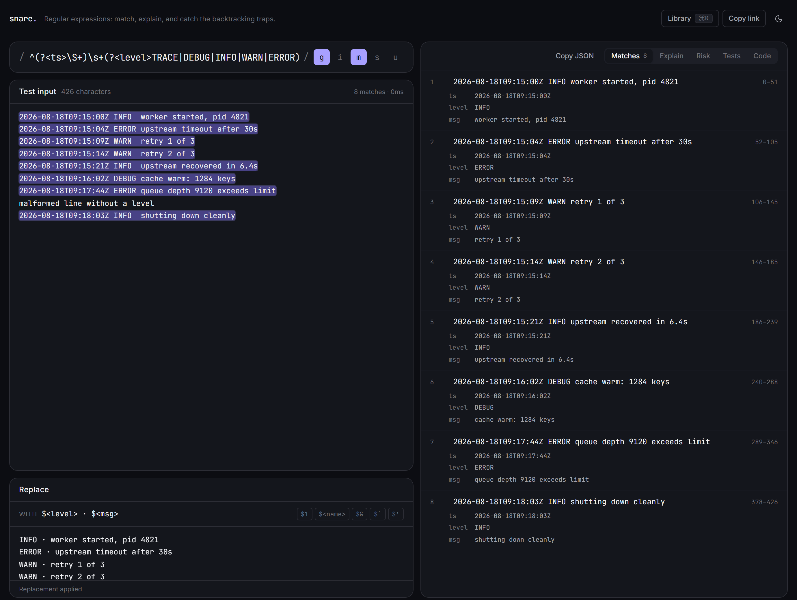

# snare

*A pattern that catches text — and the trap you can set for yourself.*

[](https://github.com/martin-k-m/snare/actions/workflows/ci.yml)
[](LICENSE)
[](https://martin-k-m.github.io/snare/)
[](src/lib)
[](#what-it-does)
[](#what-it-does)
[](#the-one-interesting-engineering-decision)

[](https://martin-k-m.github.io/snare/)

<sub>Eight log lines matched, capture groups broken out per match, and the malformed line correctly left alone. <a href="https://martin-k-m.github.io/snare/">Try it</a>.</sub>

A regular expression workbench: write a pattern, watch it match, read it back in
plain English, and find out whether it can be made to backtrack catastrophically
— before it ends up in a validator on a public endpoint.

Everything runs in the browser. Nothing you paste leaves the page.

## What it does

- **Live matching** with every match highlighted in place, capture groups (named
  and numbered) listed with their offsets, and click-to-select in the input.
- **Plain-English explanation** built from an actual parse of the pattern, not a
  lookup table: quantifiers, alternation branches, lookaround, backreferences,
  character classes and unicode property escapes all get described in reading
  order.
- **Backtracking analysis** that flags nested unbounded repetition (`(a+)+`),
  ambiguous alternation inside a repeat (`(a|ab)*`), and adjacent repeats over
  the same character set (`.*.*`).
- **Replacement preview** with `$1`, `$<name>`, `$&`, `` $` `` and `$'`.
- **Pattern library** behind `⌘K` / `Ctrl-K`, each entry with a note about where
  it stops being correct.
- **Explanation linked to the pattern** — hovering a line of the explanation
  lights up the exact slice of the expression it came from.
- **Live permalinks** — the pattern, flags, input and replacement are kept in the
  URL fragment as you type, so a refresh loses nothing and a copied link
  reproduces the workbench exactly. Nothing is stored server-side.
- **Copy matches as JSON**, groups included, for pasting into a test fixture.
- **Portability warnings.** A pattern that works here can fail elsewhere: the
  Code tab marks the targets that cannot run it and says why — Go and Rust use
  RE2, which has no lookaround or backreferences at all, and Python's lookbehind
  must be fixed width.
- **Expectations that pass or fail.** List the strings the pattern must accept
  and the ones it must reject, and watch them go green or red as you edit. A
  failing case says what actually happened — "matched “2026-08-18” but should not
  have" — which is usually the missing anchor.
- **Export to seven languages** (JavaScript, TypeScript, Python, Go, Java, Ruby,
  Rust) with the quoting done properly and the flags translated, plus a note
  wherever the target cannot express what the pattern says — Go and Rust have no
  lookaround, Ruby's `/m` is JavaScript's `s`, and Python needs `finditer` where
  JavaScript uses `g`.

## The one interesting engineering decision

A regular expression like `(a+)+$` run against a long non-matching string will
occupy the thread until the heat death of something. `RegExp.exec` cannot be
interrupted, so the usual "add a timeout" approach does not work.

Matching therefore runs in a dedicated Web Worker
([`matcher.worker.ts`](src/lib/regex/matcher.worker.ts)). If the worker does not
answer within its time budget it is **terminated**, the UI reports what happened,
and the risk panel explains why. The replacement preview only runs on the main
thread *after* the worker has proved the pattern terminates on the current input.

## Group names come from the parse, not from the values

Reading capture names off `match.groups` means matching names to slots by
comparing captured *text*, which mislabels every group whose value happens to
equal another's — `(?<first>\d)(?<second>\d)` against `11` reports two
`first`s. `captureNames()` walks the parse tree instead, so numbering and naming
stay correct whatever the input.

## Layout

```
src/
  lib/regex/
    explain.ts        recursive-descent parser producing a described tree
    matcher.ts        pattern execution, pure, no DOM — runs in worker or inline
    matcher.worker.ts worker entry point
    risk.ts           backtracking heuristics over the parsed tree
    library.ts        curated starter patterns
  lib/hooks/          worker lifecycle, theme
  components/         presentation only
  app/                route, metadata, theme tokens
```

The `lib/` layer has no React or DOM dependency, which is what makes it directly
unit-testable and reusable inside the worker.

## Deploy

**Live: <https://martin-k-m.github.io/snare/>**

Static, client-only and free of environment variables. Every push to `main`
rebuilds and republishes it through the Pages workflow; `next.config.ts` switches
to `output: "export"` with a `/snare` base path only when `GITHUB_PAGES` is set,
so local development is unaffected.

To host it on Vercel instead:

```bash
npx vercel login
npx vercel link --repo martin-k-m/snare
npx vercel --prod
```

Or import it through the dashboard:
<https://vercel.com/import/git?s=https://github.com/martin-k-m/snare>

## Development

```bash
npm install
npm run dev
```

```bash
npm test
npm run typecheck
npm run lint
npm run build
```

## Known limits

- The explanation parser models the constructs listed above. Anything more exotic
  is reported with a generic label rather than a wrong one.
- The risk checks are heuristics over pattern structure. A clean result means
  "no known hazard was found", not "this pattern is safe on adversarial input".
  Cap the length of untrusted input regardless.
- Matching uses the browser's own engine, so results reflect JavaScript
  semantics — not PCRE, RE2 or Python's `re`.

## Licence

MIT.
